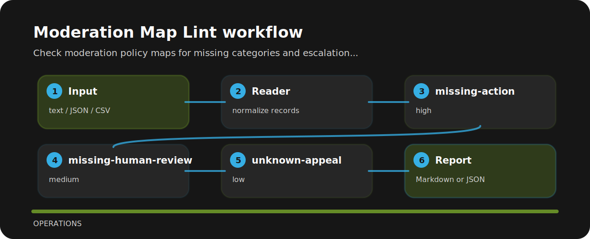

# Moderation Map Lint


Check moderation policy maps for missing categories and escalation gaps. The command is intentionally direct so it can sit in a local review, a CI step, or a one-off audit.

## Checks in plain language

| Signal | Level | What it flags | Fix direction |
| --- | --- | --- | --- |
| `missing-action` | high | policy category has no action | Declare block, allow, escalate, or transform behavior. |
| `missing-human-review` | medium | human review path is missing | Define escalation criteria and owner. |
| `unknown-appeal` | low | appeal path is unclear | Document user appeal or review process. |

## Tiny fixture

```text
risky: category self-harm action missing human_review none appeal unknown
clean: category self-harm action escalate human_review required appeal documented
```

## Local check

```bash
git clone https://github.com/mertefekurt/moderation-map-lint.git
cd moderation-map-lint
python -m pip install -e ".[dev]"
moderation-map-lint examples/sample.txt
```

## Signal route


